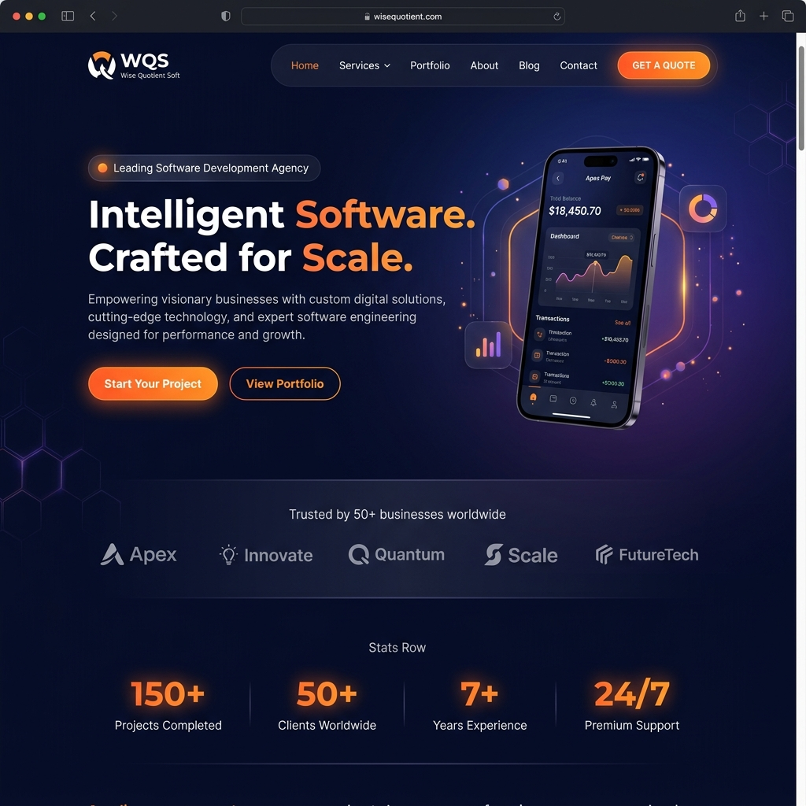
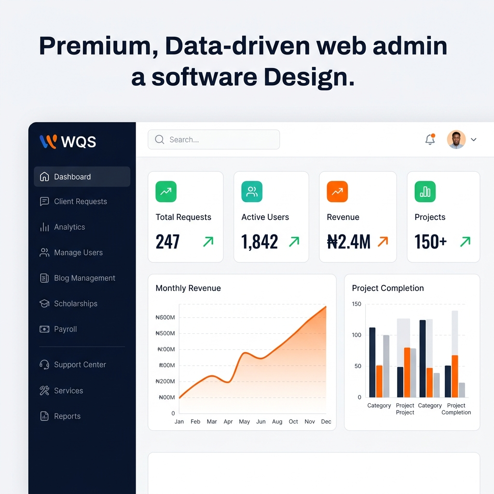
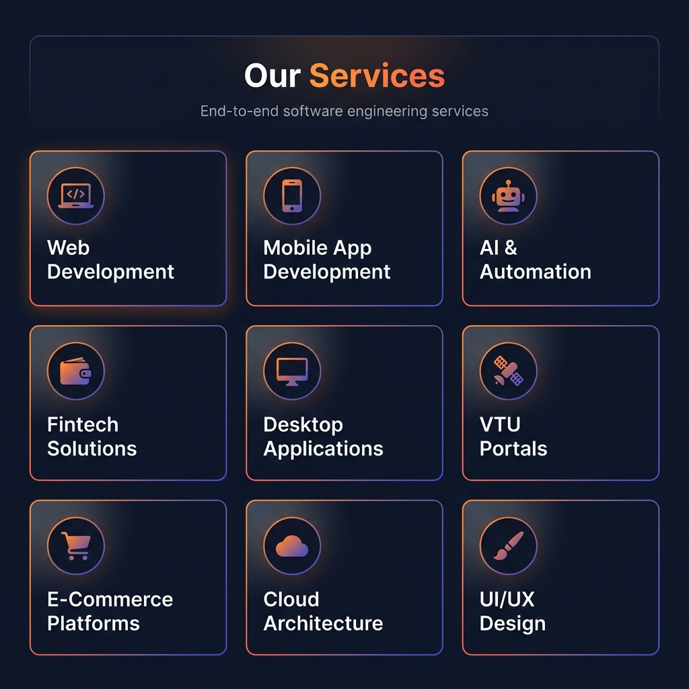

<div align="center">


# 🚀 Wise Quotient Soft (WQS)
### *Intelligent Software. Crafted for Scale.*

[](https://php.net)
[](https://mysql.com)
[](https://firebase.google.com)
[](https://getbootstrap.com)
[](https://paystack.com)
[](LICENSE)
[](https://wisequotientsoft.com)

**WQS is a full-stack, enterprise-grade software company platform** — powering client management, scholarship systems, developer hubs, AI chatbots, payroll, analytics, and more — built with PHP, MySQL, Firebase, and modern web technologies.

[🌐 Live Website](https://wisequotientsoft.com) · [📬 Contact Us](https://wisequotientsoft.com/contact.php) · [📁 Portfolio](https://wisequotientsoft.com/portforlio.php) · [📝 Blog](https://wisequotientsoft.com/blog.php)

</div>

---

## 📸 Screenshots

<div align="center">

### 🏠 Homepage — Hero Section


### 🖥️ Admin Dashboard


### ⚙️ Services Page


</div>

---

## ✨ Features

### 🌐 Public Website
| Feature | Description |
|---|---|
| **Dynamic Hero** | AI-powered A/B-tested copy rotation across 5 marketing variants using cookie tracking |
| **Services Showcase** | Dynamic services pulled from database with live pricing |
| **Portfolio Gallery** | Filterable project portfolio with live URLs and tech stack tags |
| **Blog System** | Full blog with categories, tags, comments, and rich SEO metadata |
| **Scholarship Portal** | End-to-end scholarship listing, application, interview, and certificate system |
| **AI Chatbot (WiseBot)** | Context-aware AI assistant powered by multiple LLM providers |
| **Push Notifications** | Firebase Cloud Messaging (FCM) for real-time browser notifications |
| **Contact & Inquiry** | Multi-service contact forms with email + SMS notifications |
| **SEO Optimized** | Full canonical URLs, Open Graph tags, JSON-LD structured data, sitemaps |
| **Cookie Consent** | GDPR-compliant cookie consent manager |

### 👤 User Dashboard
| Feature | Description |
|---|---|
| **Client Dashboard** | Personalized view of requests, invoices, projects, and support tickets |
| **Project Requests** | Submit, track, and discuss software project requests |
| **Invoice Management** | View, download, and pay invoices online |
| **Book Meetings** | Schedule consultations with the WQS team |
| **Partner Upgrade** | Apply to become a WQS partner/reseller with tier management |
| **Developer Hub** | Code snippets, discussion threads, and developer community space |
| **Freelance Jobs** | Browse and bid on freelance projects posted by WQS |
| **Referral Portal** | Earn commissions by referring new clients |
| **User Profile** | Full profile management with avatar, bio, and social links |
| **Documents Center** | Access signed contracts, agreements, and legal docs |
| **Notification Center** | Real-time push + in-app notification history |

### 🔐 Admin Panel
| Feature | Description |
|---|---|
| **Admin Dashboard** | Real-time KPIs: requests, revenue, active users, project metrics |
| **Client Requests** | Full request lifecycle: review, assign, update, close |
| **User Management** | Role assignment (Client, Developer, Agent, CEO, Admin) |
| **Scholarship Management** | Create scholarships, manage applications, shortlist, interview, certify |
| **Payroll System** | Multi-period payroll for employees and partners with payout approvals |
| **Invoice Management** | Generate, send, and track client invoices |
| **Blog Management** | WYSIWYG blog editor with categories, tags, and scheduling |
| **Ad Management** | Self-serve ad placement system with A/B testing and analytics |
| **Analytics & Reports** | Firebase analytics, voice analytics, API health monitoring |
| **Support Center** | Multi-channel support: tickets, chat, escalation |
| **Broadcast System** | Send bulk push notifications and emails to user segments |
| **Contract Hub** | Create, send, and digitally sign contracts |
| **Remote Config** | Update site settings without code changes |
| **Popup Manager** | Configure marketing popups and banners |

---

## 🛠️ Tech Stack

| Layer | Technology |
|---|---|
| **Backend** | PHP 8.x (no framework — vanilla OOP PHP) |
| **Database** | MySQL 8.0 via PDO |
| **Authentication** | Firebase Auth + custom PHP session management |
| **Push Notifications** | Firebase Cloud Messaging (FCM) |
| **File Storage** | Cloudinary for image/file uploads |
| **Payments** | Paystack (card + bank transfer) |
| **AI / LLM** | Multi-provider LLM (OpenAI-compatible, Gemini) via `agent-server.php` |
| **SMS** | Custom SMS helper for OTP and alerts |
| **Frontend** | Bootstrap 5, Vanilla JavaScript, CSS3 animations |
| **Icons** | Font Awesome 6 |
| **Fonts** | Google Fonts (Inter, Outfit) |
| **Server** | Apache (XAMPP / cPanel) |
| **Security** | `.htaccess` hardening, CSRF protection, PDO prepared statements |

---

## 📁 Project Structure

```
wqs/
├── 📂 admin/               # Admin panel pages (66 files)
│   ├── dashboard.php       # Admin overview & KPIs
│   ├── client_requests.php # Full request management
│   ├── manage_users.php    # User roles & management
│   ├── analytics.php       # Site analytics
│   ├── manage_blog.php     # Blog CMS
│   ├── scholarship_*.php   # Scholarship management suite
│   ├── payroll*.php        # Payroll & payout system
│   ├── support_center.php  # Support ticketing
│   ├── broadcast.php       # Push notification broadcaster
│   ├── invoice_management.php
│   ├── manage_ads.php      # Ad system with A/B testing
│   └── ...
│
├── 📂 user/                # Client/Developer user portal (31 files)
│   ├── dashboard.php       # User home dashboard
│   ├── client-request.php  # Submit & track requests
│   ├── client-invoices.php # Invoice viewer
│   ├── book_meeting.php    # Meeting scheduler
│   ├── developer_hub.php   # Dev community space
│   ├── freelance_jobs.php  # Freelance marketplace
│   ├── referral_portal.php # Referral & earnings
│   ├── profile.php         # User profile editor
│   ├── upgrade_partner.php # Partner tier upgrade
│   └── ...
│
├── 📂 includes/            # Shared components
│   ├── public_header.php   # Global site header/nav
│   ├── public_footer.php   # Global site footer
│   ├── dashboard_header.php# Authenticated header
│   ├── wise-bot.php        # AI chatbot engine
│   ├── ad_system.php       # Ad placement engine
│   ├── fcm_helper.php      # Push notification helper
│   ├── seo_helper.php      # SEO meta tag builder
│   ├── theme.css           # Global design system CSS
│   └── ...
│
├── 📂 api/                 # REST API endpoints
├── 📂 Database/            # Migration & schema scripts
├── 📂 assets/              # Static assets (JS, CSS)
├── 📂 images/              # Site images & carousel assets
├── 📂 icons/               # Custom icons
├── 📂 legals/              # Legal document templates
├── 📂 designs/             # Design assets
│
├── index.php               # 🏠 Landing page (hero, services, CTA)
├── login.php               # Authentication page
├── register.php            # User registration
├── auth.php                # Auth logic handler
├── services.php            # Services showcase
├── portforlio.php          # Project portfolio gallery
├── blog.php                # Blog listing
├── blog_detail.php         # Single blog post
├── about.php               # About the company
├── contact.php             # Contact & inquiry form
├── scholarship.php         # Scholarship listings
├── search.php              # Global search
├── agent-server.php        # AI/LLM agent backend
├── generate_invoice.php    # Invoice PDF generator
├── paystack_verify.php     # Payment verification
├── notifications_api.php   # FCM notification API
├── sitemap.php             # Dynamic XML sitemap
├── robots.txt              # SEO robots file
├── .env.example            # Environment variable template
├── .gitignore              # Git ignore rules
└── .htaccess               # Apache security config
```

---

## ⚙️ Local Setup

### Prerequisites
- PHP 8.0+
- MySQL 8.0+
- Apache (XAMPP recommended for Windows)
- Composer (optional)
- Firebase project credentials
- Paystack API keys (for payment features)
- Cloudinary account (for file uploads)

### Installation Steps

**1. Clone the repository**
```bash
git clone https://github.com/WQS-company/Wise-Quotient-Soft.git
cd Wise-Quotient-Soft
```

**2. Configure your environment**
```bash
# Copy the example env file
cp .env.example .env

# Open .env and fill in your credentials:
# - Firebase API keys
# - FCM Server Key
```

**3. Configure the database**
```bash
# Create a MySQL database named 'wqs' (or your preferred name)
# Restore/run the database schema from the Database/ folder
```

**4. Configure `config.php`**
> ⚠️ `config.php` is **not committed** (it contains credentials).
> Create it from the template or contact the WQS team for the structure.
>
> It should define:
> - `$pdo` — PDO MySQL connection
> - Application constants (site name, base URL, API keys)
> - Paystack, Cloudinary, and LLM credentials

**5. Set up Apache Virtual Host (optional)**
```apache
<VirtualHost *:80>
    ServerName wisequotientsoft.local
    DocumentRoot "C:/xampp/htdocs/dashboard/wqs"
    <Directory "C:/xampp/htdocs/dashboard/wqs">
        AllowOverride All
        Require all granted
    </Directory>
</VirtualHost>
```

**6. Start XAMPP and visit**
```
http://localhost/dashboard/wqs/
```

---

## 🔒 Security

WQS is built with security best practices:

- **`.htaccess` hardening** — Blocks direct access to sensitive files (`.env`, `config.php`, `firebase-service-account.json`, `.sql` dumps, `.zip` archives, `*.log` files)
- **PDO Prepared Statements** — All database queries use parameterized queries to prevent SQL injection
- **CSRF Protection** — Form submissions are validated with CSRF tokens
- **Role-Based Access Control** — Five user roles: `client`, `developer`, `agent`, `admin`, `ceo`
- **Firebase Auth** — Secure token-based authentication for real-time features
- **Environment Variables** — All sensitive credentials stored in `.env` (excluded from version control)
- **Input Sanitization** — All user inputs are sanitized with `htmlspecialchars()` and server-side validation

---

## 🎨 Design System

The WQS platform uses a **unified design system** defined in `includes/theme.css`:

| Token | Value | Usage |
|---|---|---|
| Primary Brand | `#ff6600` | CTAs, highlights, accents |
| Dark Background | `#0f172a` | Page backgrounds, hero |
| Deep Navy | `#020617` | Hero section |
| Indigo Accent | `#6366f1` | UI elements, avatars |
| Success | `#10b981` | Positive metrics, status |
| Warning | `#f59e0b` | Alerts, pending states |
| Font | Inter, Outfit (Google Fonts) | All text |

---

## 🤖 AI Features (WiseBot)

The platform ships with **WiseBot**, a multi-model AI assistant (`includes/wise-bot.php`):

- 💬 **Contextual chat** — Understands WQS services, pricing, and FAQs
- 🔀 **Multi-provider** — Supports OpenAI-compatible APIs and Google Gemini
- 📊 **Analytics** — Chat logs stored for admin review (`admin/bot_chats.php`)
- 🎙️ **Voice analytics** — Voice interaction tracking (`admin/voice_analytics.php`)
- 📢 **Daily AI Notifications** — Cron-powered AI-generated notification content (`cron_daily_ai_notifications.php`)

---

## 📊 Scholarship System

A full-featured scholarship management platform built in:

**Public Pages:**
- `scholarships.php` — Browse all available scholarships
- `scholarship.php` — Scholarship details
- `scholarship_apply.php` — Multi-step application form
- `scholarship_track.php` — Track application status

**Admin Pages:**
- Create, edit, and manage scholarships
- Review applications → Shortlist → Interview → Approve/Disqualify
- Issue digital certificates
- Manage sponsors and categories
- Generate reports and payment records

---

## 💳 Payment Integration

Powered by **Paystack**:
- Client invoice payments online
- Partner payout requests
- Scholarship payment tracking
- Webhook verification via `paystack_verify.php`

---

## 🚀 Deployment

The project is deployed on **cPanel / Apache hosting**.

**Production URL:** [https://wisequotientsoft.com](https://wisequotientsoft.com)

**Git workflow:**
```bash
# Make changes locally
git add .
git commit -m "Your commit message"
git push origin main
# Then pull on the production server
```

---

## 👥 Team

Built and maintained by the **Wise Quotient Soft Engineering Team**.

- 🌍 Based in **Kaduna, Nigeria**
- 🌐 Serving clients **globally**
- 💼 [LinkedIn](https://linkedin.com/company/wise-quotient-soft)
- 📧 [contact@wisequotientsoft.com](mailto:contact@wisequotientsoft.com)

---

## 📄 License

This project is **proprietary software** owned by Wise Quotient Soft Ltd.  
All rights reserved. Unauthorized copying, distribution, or use is strictly prohibited.

---

<div align="center">

**Made with ❤️ by [Wise Quotient Soft](https://wisequotientsoft.com)**  
*Intelligent Software. Crafted for Scale.*

</div>
